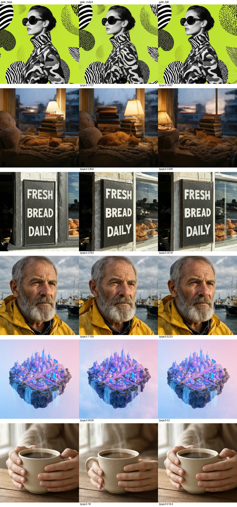

Follow me on X for more updates: https://x.com/jayleaton

# Qwen-Image 2.1 on TensorFold kernels, one RTX 5070 Ti (native Windows)

A faster way to run Qwen-Image 2.1 in ComfyUI: a drop-in loader node that runs the 7B DiT on
[TensorFold](https://github.com/ashhart/TensorFold)'s NVFP4 W4A4 tensor-core kernels instead of ComfyUI's GGUF path.
Your workflow, text encoder, sampler, VAE and the QwenImage21Cache node stay exactly as they are; you swap
`Unet Loader (GGUF)` for **TensorFold Qwen-Image 2.1 Loader**. The engine (`tfimage/`) is new: TensorFold is an LLM
engine with no diffusion family, so this repo adds the Qwen-Image 2.1 DiT, a GGUF reader, activation calibration and
the ComfyUI glue, and uses TensorFold (pinned, unmodified submodule) for its NVFP4 / FP8 GEMMs.

> **Work in progress.** Measured on one desktop (RTX 5070 Ti 16 GB, Blackwell sm_120, Windows 11). Knobs, defaults
> and numbers may change between commits. NVFP4 changes fine detail and, on some prompts, composition: read
> [Quality](#quality) and [Limits](#limits-and-negatives) before relying on it.

SPDX-License-Identifier: Apache-2.0 (this project's own code, scripts, benchmarks and docs; see [Licensing](#licensing)).

## Results

Same ComfyUI (0.37.0, torch 2.10+cu130), same workflow and settings: 25 steps, euler, simple, CFG 1, Qwen3-VL 8B
int8_convrot text encoder, bf16 VAE. Baseline: the Q6_K GGUF through ComfyUI-GGUF. Warm runs (models resident),
seconds per image, end to end (text encode, 25 steps, VAE decode):

| Size | ComfyUI GGUF Q6_K | **This (NVFP4)** | Speedup | This (FP8) |
| --- | ---: | ---: | ---: | ---: |
| 1024x1024 | 33.0 | **8.0-8.4** | **4.0x** | 16.7-17.8 (1.9x) |
| 992x1216 | 35.7 | **9.4** | **3.8x** | |
| 480x608 | 16.1 | **1.9** | **8.4x** | |

One DiT step at 1024x1024: 1.07-1.39 s in ComfyUI, **0.29-0.30 s** here. DiT weights in VRAM: 3.66 GiB (the Q6_K
GGUF is 5.9 GB). Engine load from its converted cache: ~2 s.

Where the time went, and where it goes now (one 1024x1024 step, 4,096 image tokens):

| | ComfyUI GGUF | This (NVFP4) |
| --- | --- | --- |
| Weights | Q6_K decoded to bf16 every step (eager torch bit ops, ~65% of GPU time) | NVFP4, never decoded |
| Linears | cuBLAS bf16, ~0.6 s (80-97 TF/s) | TensorFold FP4 x FP4 block-scaled MMA, 124 ms (365-519 TF/s) |
| Attention | cuDNN flash, ~100 ms | cuDNN flash, 101 ms |
| Norms, RoPE, SwiGLU | | fused Triton kernels + TensorFold's gate/up GEMM with a SwiGLU epilogue that writes FP4 rows, ~25 ms |
| Text / reference tokens | kept K/V per sampling run | kept K/V per prompt (reused across seeds and runs) |

Full baseline, profile, per-lever numbers and the plan: [`docs/RESULTS.md`](docs/RESULTS.md).

## Quality

Six fixed-seed prompts rendered by the baseline and by this engine, compared image to image
(`bench/quality.py`: LPIPS-alex, DINOv2-S cosine, PSNR). The gate was set before the run: mean LPIPS <= 0.25 and mean
DINO >= 0.95.

| | mean LPIPS | mean DINO | worst LPIPS | gate |
| --- | ---: | ---: | ---: | --- |
| NVFP4 | 0.193 | 0.908 | 0.378 | LPIPS pass, **DINO fail** |
| FP8 | 0.126 | 0.920 | 0.352 | LPIPS pass, **DINO fail** |



Both quantized paths miss the DINO bar on the same two prompts (reading nook, bakery sign), where any numeric change
moves the layout (lamp, book stack, window); on the other four FP8 is near-identical and NVFP4 changes fine detail
(the camouflage pattern, a hand's grip). Every NVFP4 image is clean: text spelled right, five fingers, coherent faces.
Treat NVFP4 as "same prompt, slightly different image": for pixel-faithful reproductions of a GGUF render, use the
GGUF loader.

Correctness of the engine itself: its bf16 path matches ComfyUI's forward on the same weights to bf16 noise (relative
L2 0.005, cosine 0.99996) for text-to-image and with a reference latent (edit), and its GGUF decoders are bit-exact
against gguf-py (`tools/check_forward.py`, `tools/check_gguf_dequant.py`).

## Use it

For an OpenAI-compatible image server (generation and reference-image edits), see
[`docs/OPENAI-SERVER.md`](docs/OPENAI-SERVER.md). The current standalone API owns a
private headless ComfyUI compatibility backend; the ComfyUI-free port is still pending.

Requirements: an NVIDIA RTX 50-series GPU (compute capability 12.x; NVFP4 needs the block-scaled FP4 MMA), a recent
driver (tested 617.14), ComfyUI portable with torch 2.10+cu130 and ComfyUI-GGUF, Visual Studio 2022/2026 with the C++
x64 tools (to build the kernels once), Python 3.13, [uv](https://docs.astral.sh/uv/). Step by step, with checks:
[`AGENTS.md`](AGENTS.md).

```bat
git clone --recurse-submodules https://github.com/jayleaton/qwen-image21-tensorfold-rtx
cd qwen-image21-tensorfold-rtx
scripts\setup.cmd                       :: venv, NVIDIA's pip CUDA 13.4 toolkit, builds TensorFold's kernels for your GPU
set COMFYUI_PORTABLE=D:\path\to\ComfyUI_windows_portable
%COMFYUI_PORTABLE%\python_embeded\python.exe -B bench\comfy_dump_contexts.py   :: calibration prompts' text embeddings
tools\env.cmd python bench\calibrate_run.py                                     :: convert + calibrate (once, ~70 s)
```

Then make the node visible to ComfyUI, either with a directory junction
(`mklink /J "%COMFYUI_PORTABLE%\ComfyUI\custom_nodes\ComfyUI-TensorFold-Image" "%CD%\comfyui\ComfyUI-TensorFold-Image"`)
or an `extra_model_paths.yaml` entry with `custom_nodes:` pointing at `comfyui/`. In your Qwen-Image 2.1 workflow
replace `Unet Loader (GGUF)` with **TensorFold Qwen-Image 2.1 Loader** (same GGUF, precision `nvfp4`).

The node loads the kernels built into `.build/torch_ext` directly, so ComfyUI's embedded Python needs no compiler
(same torch 2.10+cu130 and Python 3.13 ABI). The converted engine is cached in `%LOCALAPPDATA%\tfimage` (4.2 GB;
`TFIMAGE_CACHE` moves it); keep it on an internal NVMe drive.

Precisions: `nvfp4` (fastest), `fp8` (closer to the GGUF, 1.9x), `nvfp4:edge=2` (first and last two blocks FP8),
`bf16-check` (reference, slow: streams bf16 weights from system RAM).

## Limits and negatives

- **Refused, with an error** (never silently ignored): LoRA / weight patches, ControlNet, block or attention patches.
  Use the GGUF loader for those workflows.
- Quality gate: DINO fails as above. Fidelity work (FP8 for sensitive blocks, a low-rank residual) is planned.
- The edit path (reference images) is verified at the forward level, not yet timed end to end.
- Not measured: 2048x2048, a cold start with the OS file cache flushed, other GPUs (an RTX 5090 should scale with its
  FP4 rate; RTX 40-series has no FP4 MMA and would need the FP8 path).
- CUDA graphs are not used: the step is GPU-bound with no host syncs, so launch overhead is already hidden.
- Not tried: ComfyUI's own `qwen_image_2.1_int8_convrot` checkpoint (int8 tensor cores through comfy-kitchen) as a
  no-code middle ground; expect roughly FP8-class speed.
- TensorFold on native Windows needed workarounds (CUDA 13.4 for VS 2026, CUDA_HOME, header wheels):
  [`docs/TENSORFOLD-WINDOWS.md`](docs/TENSORFOLD-WINDOWS.md).

## Repository

| Path | What |
| --- | --- |
| `tfimage/` | the engine: `qwen_image21.py` (DiT, kept prefix K/V), `linear.py` (bf16 / FP8 / NVFP4 on TensorFold), `kernels.py` (fused Triton), `gguf_load.py`, `calibrate.py`, `store.py` (converted cache), `ext.py` (prebuilt kernels), `comfy_nodes.py` |
| `comfyui/ComfyUI-TensorFold-Image/` | the ComfyUI custom node package |
| `bench/` | ComfyUI baseline / profile / quality-gate harness, calibration |
| `tools/` | correctness checks, GEMM and attention probes, `env.cmd` (MSVC + pip CUDA toolkit) |
| `vendor/TensorFold` | TensorFold v0.6.1, unmodified submodule |
| `scripts/check-public.sh` | scan for private details before publishing |

## Licensing

This project's own code, scripts, benchmarks and documentation are Apache-2.0 ([`LICENSE`](LICENSE)); third-party
work keeps its own license, listed in [`NOTICE`](NOTICE). TensorFold is included as an unmodified submodule
(Apache-2.0 from 0.6.0). ComfyUI (GPL-3.0) and ComfyUI-GGUF (Apache-2.0) are not included: the node runs inside your
ComfyUI. No model weights are included; Qwen-Image 2.1, its text encoder and VAE are downloaded by each user under
their own terms.

## Credits

[TensorFold](https://github.com/ashhart/TensorFold) by ashhart and contributors (the NVFP4 / FP8 kernels this runs
on); the Qwen team (Qwen-Image 2.1); ComfyUI and Comfy-Org (the reference implementation and the host);
[ComfyUI-GGUF](https://github.com/city96/ComfyUI-GGUF) by city96.
